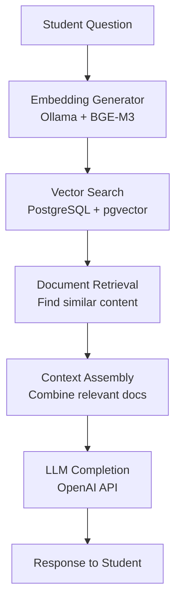

# Section 3: Architecture & Vocabulary
## Understanding How the Pieces Fit Together

---

## Quick Check-In

**From Section 2, what questions do you have about:**

🤔 **Vector similarity scores?**

🤔 **The embedding black box?**

🤔 **How this all connects together?**

*30 seconds to think, then share one with your neighbor*

---

## Today's Journey

🏗️ **System Architecture** - How components work together

📖 **Vocabulary in Context** - Terms that matter for Edinburgh

🔧 **Component Deep Dive** - Inside the black boxes

🔍 **Troubleshooting** - When things go wrong

---

# Part 1: The Big Picture
## RAG System Architecture

---

## Activity: Build the System

**Teams of 4 - 5 minutes**

**Your challenge:** A new Edinburgh student asks "How do I reset my password?"

**Your task:** Using these component cards, arrange the flow from question to answer

---

## Component Cards

**User Interface**
*Student types question*

**Embedding Generator** 
*Ollama + BGE-M3*

**Vector Database**
*PostgreSQL + pgvector*

**Document Retrieval**
*Find similar content*

**LLM Completion**
*OpenAI API*

**Response Generator**
*Combine context + query*

**Knowledge Base**
*Edinburgh IT policies*

**Quality Filter**
*Check confidence scores*

---

## Let's Build It Together

**Step-by-step flow reconstruction**

*Teams share their arrangements - we'll build the correct flow*

---

## The RAG Architecture

---

## Data Flow: "How do I reset my password?"

**1. Question** → "How do I reset my password?"

**2. Embedding** → [0.2, -0.1, 0.8, 0.3, ...]

**3. Vector Search** → Find similar document chunks

**4. Retrieval** → Edinburgh IT policy sections

**5. Context** → Relevant policy + user question

**6. Generation** → "To reset your Edinburgh password, visit..."

---

## Why This Architecture?

**Modular** - Each component has one job

**Scalable** - Add more documents without retraining

**Accurate** - Grounded in real Edinburgh policies

**Maintainable** - Update documents, not the AI

---

# Part 2: Component Deep Dive
## Understanding Each Building Block

---

## Component 1: The User Interface

**What it does:** Accepts student questions

**Edinburgh considerations:**
- Single Sign-On integration?
- Mobile-friendly for students?
- Accessible for all users?

---

## Component 2: Embedding Generator (Ollama)

**What it does:** Converts text to 1024-dimension vectors

**Why Ollama for Edinburgh:**
- **Privacy:** Runs locally, no data sent to third parties
- **Cost:** No per-token charges
- **Control:** University owns the process

---

## Component 3: Vector Database (PostgreSQL + pgvector)

**What it does:** Stores and searches embeddings

**Why PostgreSQL:**
- **Familiar:** Edinburgh already uses PostgreSQL
- **Integrated:** Vectors + relational data + JSON
- **Reliable:** Battle-tested in production

---

## Component 4: Knowledge Base

**What it contains:** Edinburgh-specific documents

**Examples:**
- IT support procedures
- Student services policies
- Academic regulations
- Accommodation guidelines

---

## Component 5: LLM Completion (OpenAI)

**What it does:** Generates human-like responses

**Why external LLM:**
- **Quality:** Better language generation
- **Cost-effective:** Pay per use
- **No training needed:** Works immediately

---

## Activity: Component Health Check

**Pairs - 3 minutes each component**

**Your task:** For each component, identify:
- **What could go wrong?**
- **How would you know it's broken?**
- **How would you fix it?**

---

## Component Health Checks

**Ollama Embedding**
- ❌ Service down
- ❌ Model not loaded
- ❌ Out of memory

**PostgreSQL + pgvector**
- ❌ Database connection issues
- ❌ Index corruption
- ❌ Disk space full

**Knowledge Base**
- ❌ Outdated documents
- ❌ Missing content
- ❌ Poor chunking

**OpenAI API**
- ❌ Rate limits hit
- ❌ API key expired
- ❌ Network timeouts

---

# Part 3: Vocabulary in Context
## Terms That Matter for Edinburgh Systems

---

## Vocabulary Learning Activity

**Individual - 2 minutes**

**Rate your understanding (1-5) of these terms in the context of Edinburgh AI systems:**

---

## Technical Terms Assessment

- **Embedding model** (1-5): ___
- **Vector index** (1-5): ___
- **Cosine similarity** (1-5): ___
- **Context window** (1-5): ___
- **Chunking strategy** (1-5): ___

- **RAG pipeline** (1-5): ___
- **Prompt engineering** (1-5): ___
- **Temperature** (1-5): ___
- **Retrieval threshold** (1-5): ___
- **Hallucination detection** (1-5): ___

---

## Vocabulary in Action: Embedding Model

**Definition:** The AI model that converts text to numerical vectors

**Edinburgh context:** "Should we use BGE-M3 or OpenAI embeddings for our student support system?"

**Decision factors:**
- Privacy (local vs cloud)
- Cost (free vs per-token)
- Quality (accuracy for Edinburgh content)

---

## Vocabulary in Action: Vector Index

**Definition:** Database structure for fast similarity search

**Edinburgh context:** "Our vector search is taking 30 seconds per query"

**Technical solution:**
- **HNSW index** for approximate nearest neighbors
- **Trade-off:** Speed vs accuracy
- **Configuration:** Index parameters for Edinburgh scale

---

## Vocabulary in Action: Context Window

**Definition:** Maximum text length an LLM can process at once

**Edinburgh context:** "Can we include all relevant policy documents in one query?"

**Practical implications:**
- **GPT-4:** ~8,000 tokens context limit
- **Strategy:** Retrieve most relevant chunks only
- **Quality:** Better to be selective than truncate

---

## Vocabulary in Action: Temperature

**Definition:** Controls randomness in LLM responses

**Edinburgh context:** "Should our support bot give creative or consistent answers?"

**Setting guidance:**
- **Temperature 0.1:** Consistent, factual responses
- **Temperature 0.7:** More creative, varied responses
- **Edinburgh choice:** Low temperature for policy questions

---

## Activity: Vocabulary Translation

**Pairs - 4 minutes**

**Your task:** Translate these technical conversations into plain English for Edinburgh stakeholders

---

## Translation Scenarios

**Scenario A:** "We need to tune our retrieval threshold because we're getting too many false positives with cosine similarity below 0.7"

**Scenario B:** "The embedding model is creating high-dimensional representations, but our vector index isn't optimized for this scale"

**Scenario C:** "We should implement prompt engineering to reduce hallucination when the context window exceeds our token limits"

**Goal:** Explain the problem and solution in terms Edinburgh IT managers would understand

---

# Part 4: Troubleshooting Simulation
## When Things Go Wrong

---

## Edinburgh IT Emergency!

**Breaking:** The student support AI is giving weird responses

**Your role:** Technical troubleshooting team

**Your mission:** Diagnose and fix the problem

---

## Problem Report: Case 1

**User complaint:** "I asked about booking a study room and got information about hotel reservations"

**System logs:**
- Embedding generation: ✅ Working
- Vector search: ✅ Returning results  
- LLM completion: ✅ Generating responses
- Response time: ✅ Normal

**Question:** What's wrong and how do you fix it?

---

## Troubleshooting Process

**Teams of 3 - 5 minutes**

**Step 1:** Identify which component is likely the problem

**Step 2:** What specific issue within that component?

**Step 3:** How would you test your hypothesis?

**Step 4:** What's your fix?

---

## Problem Report: Case 2

**User complaint:** "The AI says 'I don't have information about that' for common password reset questions"

**System logs:**
- Embedding generation: ✅ Working
- Vector search: ❌ No similar documents found (similarity < 0.3)
- Knowledge base: Contains password reset procedures
- LLM completion: Not reached

**Question:** What's wrong and how do you fix it?

---

## Problem Report: Case 3

**User complaint:** "Responses are taking 2 minutes and sometimes timeout"

**System logs:**
- Embedding generation: ⚠️ 5 seconds per query
- Vector search: ⚠️ 45 seconds per search
- Database: 50,000 documents, no vector index
- LLM completion: ⚠️ 30 seconds when reached

**Question:** What's wrong and how do you fix it?

---

## Teams Report Back

**Each team shares their diagnosis for one case**

**Focus on:**
- Which component is the root cause?
- What specific fix would you implement?
- How would you prevent this in the future?

---

## Common Troubleshooting Patterns

**Wrong results:** Usually knowledge base or retrieval issues

**"I don't know" responses:** Vector similarity threshold or missing content

**Slow performance:** Missing indexes or oversized contexts

**Service errors:** Component health monitoring needed

---

# Part 5: Hands-On Lab Preview
## Architecture in Action

---

## Lab Objectives

**Build mental model** of complete system

**Inspect real components** with Edinburgh data

**Practice troubleshooting** with simulated issues

---

## Lab Structure

**Part 1:** Edinburgh document ingestion pipeline

**Part 2:** Component inspection and health checks

**Part 3:** Trace a query through the entire system

**Part 4:** Break something and fix it!

---

## Ready to Get Technical?

**Questions about the architecture before we build it?**

---

## Lab Time!

**Go to:** `final_materials/section-03-architecture/lab/`

**Time:** 30 minutes

**Goal:** Deep understanding of RAG system architecture