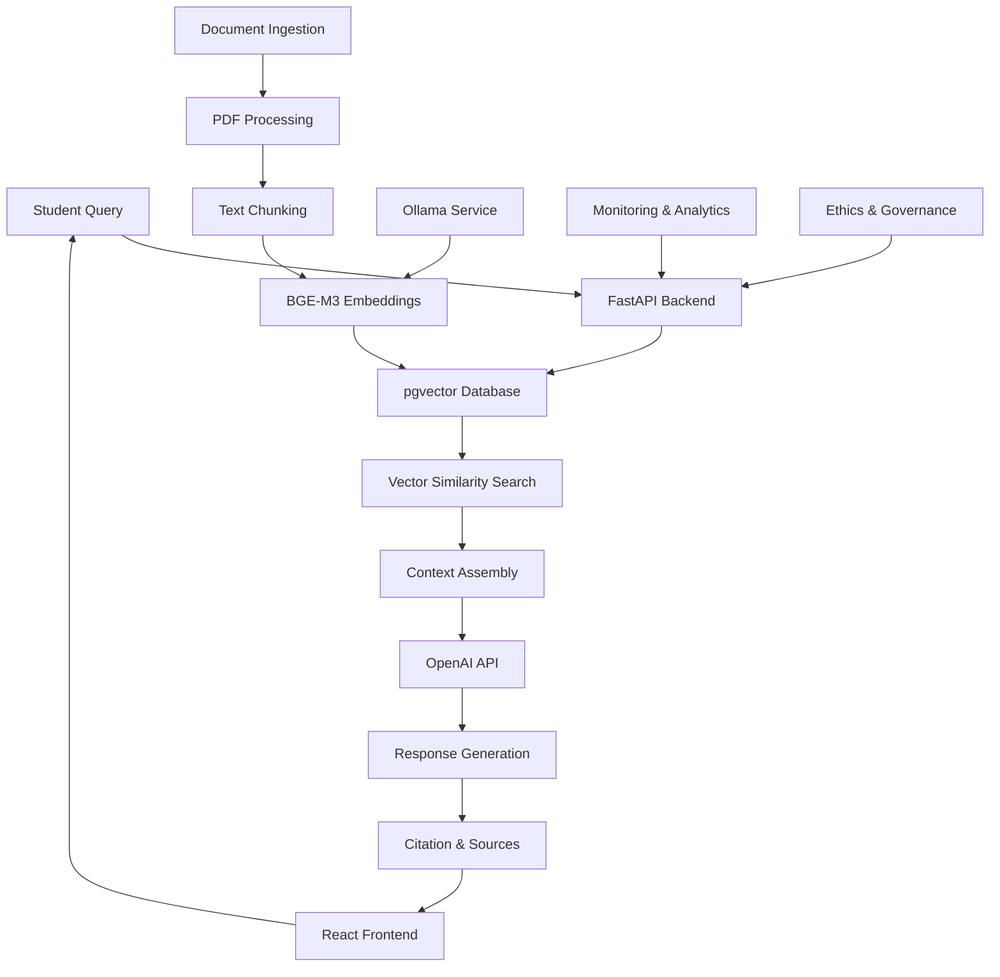

<!-- Slide 1 -->

# Capstone Lab: Student Support Chatbot

### Bringing It All Together

- Apply everything learned: vectors, RAG, ethics, production deployment
- Build a complete AI system from scratch
- Real-world scenario: Edinburgh University student support
- Measure, evaluate, and present your findings

<!-- 🗣️ Speaker Notes:
This capstone represents the culmination of the entire course. Participants will integrate all concepts learned - from vector embeddings to ethical AI governance - in building a practical student support system. -->

---

<!-- Slide 2 -->

## Project Overview

### What You'll Build

- **Intelligent Student Support Chatbot** for Edinburgh University
- **Knowledge Base**: Course handbooks, policies, FAQs, procedures
- **RAG Pipeline**: Vector search + LLM completion with source citation
- **Web Interface**: Clean, accessible UI for student interactions
- **Analytics Dashboard**: Performance metrics and usage insights

<!-- 🗣️ Speaker Notes:
The system will handle real student queries like "How do I change my course?" or "What are the library opening hours?" with accurate, cited responses. -->

---

<!-- Slide 3 -->

## Architecture Review

<!-- 🗣️ Speaker Notes:
This diagram shows how all course components integrate: document processing (Section 5), vector database (Section 4), RAG pipeline (Section 6), production deployment (Section 8), and ethical governance (Section 9). -->

---

<!-- Slide 4 -->

## Success Criteria

### Technical Performance
- **Response Time**: < 3 seconds for typical queries
- **Accuracy**: 85%+ relevant responses in evaluation dataset
- **Source Citation**: All responses include verifiable sources
- **System Reliability**: 99%+ uptime during demonstration

### User Experience
- **Intuitive Interface**: Clear, accessible design
- **Helpful Responses**: Actually solve student problems
- **Transparent AI**: Users understand when AI is being used

### Ethical Compliance
- **Privacy Protection**: No personal data stored unnecessarily
- **Bias Monitoring**: Fair responses across all student groups
- **Human Oversight**: Clear escalation paths

---

<!-- Slide 5 -->

## Lab Structure & Timeline

### Phase 1: Foundation (90 minutes)
- Set up integrated development environment
- Ingest and process Edinburgh University documents
- Build and optimize vector database

### Phase 2: Core Development (120 minutes)
- Implement RAG pipeline with advanced querying
- Build FastAPI backend with proper error handling
- Create responsive React frontend

### Phase 3: Production & Ethics (90 minutes)
- Add monitoring, logging, and analytics
- Implement ethical safeguards and governance
- Deploy with production-ready configuration

### Phase 4: Evaluation & Presentation (60 minutes)
- Test system performance and accuracy
- Analyze results and identify improvements
- Present findings and demo to group

---

<!-- Slide 6 -->

## Knowledge Base Content

### Edinburgh University Documents
- **Student Handbooks**: Academic regulations, degree requirements
- **Course Catalogs**: Module descriptions, prerequisites, timetables
- **Support Services**: Counseling, accessibility, financial aid
- **Campus Information**: Facilities, accommodation, dining
- **Policies & Procedures**: Academic integrity, appeals, complaints

### Document Processing Strategy
- **Chunking**: Semantic segmentation preserving context
- **Metadata**: Document type, authority level, last updated
- **Quality Control**: Remove outdated or contradictory information
- **Accessibility**: Ensure content works for all students

---

<!-- Slide 7 -->

## Key Implementation Challenges

### Technical Challenges
- **Context Window Management**: Balance completeness vs. token limits
- **Multi-Document Synthesis**: Combine information from multiple sources
- **Query Understanding**: Handle ambiguous or incomplete questions
- **Performance Optimization**: Sub-3-second response times

### Content Challenges
- **Information Currency**: Ensure answers reflect current policies
- **Authority Hierarchy**: Prioritize official vs. unofficial sources
- **Contradiction Resolution**: Handle conflicting information gracefully

### User Experience Challenges
- **Query Refinement**: Help users ask better questions
- **Fallback Handling**: Graceful degradation when AI can't help
- **Accessibility**: Support users with different needs and abilities

---

<!-- Slide 8 -->

## Evaluation Framework

### Automated Testing
- **Response Quality**: Semantic similarity to expected answers
- **Source Accuracy**: Correct citation and attribution
- **Performance Metrics**: Latency, throughput, error rates
- **Bias Detection**: Fairness across different query types

### Manual Evaluation
- **User Testing**: Real student scenarios and feedback
- **Expert Review**: Subject matter expert validation
- **Edge Case Analysis**: How system handles unusual queries

### Test Query Categories
- **Factual**: "What are the library opening hours?"
- **Procedural**: "How do I change my course?"
- **Policy**: "What happens if I miss an exam?"
- **Comparative**: "What's the difference between BSc and MA degrees?"

---

<!-- Slide 9 -->

## Production Deployment Considerations

### Infrastructure Requirements
- **Scalability**: Handle 1000+ concurrent users
- **Reliability**: 99.9% uptime with proper failover
- **Security**: Protect against common web vulnerabilities
- **Monitoring**: Real-time performance and error tracking

### Operational Procedures
- **Content Updates**: Process for updating knowledge base
- **Performance Monitoring**: Ongoing quality assessment
- **User Feedback**: Collection and response mechanisms
- **Incident Response**: Clear escalation and resolution procedures

### Integration Points
- **University Systems**: SSO, student records, course management
- **Support Services**: Handoff to human advisors when needed
- **Analytics**: Integration with institutional dashboards

---

<!-- Slide 10 -->

## Ethical Implementation

### Privacy Protection
- **Data Minimization**: Only collect necessary information
- **Anonymization**: No personal identifiers in logs
- **Retention Policies**: Clear data lifecycle management
- **GDPR Compliance**: Full data subject rights implementation

### Fairness & Bias Prevention
- **Representative Training**: Diverse document sources
- **Bias Testing**: Regular evaluation across student groups
- **Inclusive Language**: Respectful, accessible communication

### Transparency & Accountability
- **AI Disclosure**: Clear indication when AI is being used
- **Source Attribution**: All responses include citations
- **Limitations**: Honest about what the system can/cannot do
- **Human Oversight**: Clear escalation to human support

---

<!-- Slide 11 -->

## Presentation Requirements

### Technical Demonstration (10 minutes)
- **Live System Demo**: Show the chatbot answering real queries
- **Architecture Walkthrough**: Explain key technical decisions
- **Performance Metrics**: Present quantitative results

### Analysis & Reflection (10 minutes)
- **What Worked Well**: Successful implementation aspects
- **Challenges Encountered**: Problems and how you solved them
- **Lessons Learned**: Key insights from the development process
- **Future Improvements**: What you would do differently/additionally

### Team Q&A (5 minutes)
- Be prepared to discuss technical choices and trade-offs
- Explain ethical considerations and compliance measures
- Share insights about production deployment challenges

---

<!-- Slide 12 -->

## Getting Started

### Pre-Lab Setup
- Ensure Docker environment is running smoothly
- Clone the capstone starter repository
- Download Edinburgh University document corpus
- Verify API keys and external service connections

### Team Formation
- Work in pairs or small teams (2-3 people)
- Designate roles: backend, frontend, DevOps, evaluation
- Set up shared development environment

### Success Mindset
- **Iterate Quickly**: Start simple, add complexity gradually
- **Measure Everything**: Make decisions based on data
- **Think Like Users**: Prioritize actual student needs
- **Embrace Failure**: Learn from what doesn't work

---

<!-- Slide 13 -->

## Course Integration Checklist

Make sure your capstone demonstrates:

### ✅ Technical Skills
- Vector embeddings and similarity search (Sections 2-4)
- Document processing and chunking strategies (Section 5)
- RAG pipeline implementation (Section 6)
- Advanced hybrid queries (Section 7)
- Production deployment practices (Section 8)

### ✅ Ethical Considerations
- AI governance framework application (Section 9)
- Privacy protection and GDPR compliance
- Bias detection and mitigation measures
- Transparency and user rights

### ✅ Professional Skills
- Project planning and execution
- Technical communication and presentation
- Problem-solving and debugging
- Quality assurance and testing

---

<!-- Slide 14 -->

# Ready to Build?

### Let's Create Something Amazing! 🚀

- You have all the knowledge and skills needed
- Work together, learn from each other
- Focus on solving real student problems
- Build something you'd be proud to deploy

### Remember: This is **your** capstone project
- Make technical choices you can justify
- Prioritize features that add real value
- Document your learning journey
- Have fun building the future of student support!

---

<!-- Slide 15 -->

## Lab Instructions Overview

### 🎯 **Your Mission**
Build a production-ready student support chatbot that Edinburgh University could actually deploy.

### 📋 **Deliverables**
1. Working chatbot with web interface
2. Performance evaluation report
3. Technical architecture documentation
4. Ethical compliance assessment
5. 25-minute team presentation

### ⏰ **Timeline**
- **Setup & Ingestion**: 90 minutes
- **Core Development**: 120 minutes  
- **Production & Ethics**: 90 minutes
- **Testing & Presentation Prep**: 60 minutes

### 🏆 **Success Criteria**
A system that's technically sound, ethically compliant, and genuinely helpful to students.

**Let's begin!** 

<!-- 🗣️ Speaker Notes:
Transition to hands-on lab. Emphasize that this is their chance to showcase everything they've learned. The next 6 hours will be intensive but rewarding. Remind them to ask for help when needed and support each other. -->