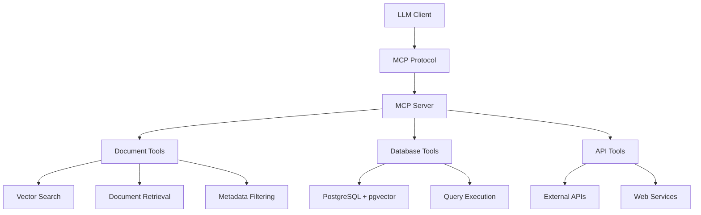

# Section 6.5: Model Context Protocol (MCP)
## Extending LLMs with Structured Tools

---

## Journey

<span class="fragment">🎯 **What is MCP?** - The standardized way to give LLMs access to tools</span>

<span class="fragment">🎯 **Document Tools** - Building tools for document search and querying</span>

<span class="fragment">🎯 **MCP Server Implementation** - Creating your own MCP server in Python</span>

<span class="fragment">🎯 **Integration Patterns** - How MCP tools work with RAG and vector databases</span>

<span class="fragment">🎯 **Production Considerations** - Error handling, security, performance</span>

---

## What is Model Context Protocol (MCP)?

### **The Missing Link Between LLMs and Tools**

<span class="fragment">**MCP is a standardized protocol** that allows LLMs to securely access external tools and data sources</span>

<span class="fragment">**Think of it as:** A universal adapter that lets any LLM use any tool</span>

<span class="fragment">**Key Benefits:**
- **Standardized Interface**: One protocol for all tools
- **Security**: Controlled access to external resources
- **Composability**: Mix and match tools as needed
- **Production Ready**: Built for real-world applications</span>

---

## MCP vs. Traditional Function Calling

### **Traditional Approach: Direct API Integration**

```python
# Direct API call - tightly coupled
def search_documents(query):
    response = requests.post("/api/search", json={"query": query})
    return response.json()
```

### **MCP Approach: Standardized Tool Interface**

```python
# MCP tool - loosely coupled, reusable
@mcp_tool
def search_documents(query: str) -> str:
    """Search documents using vector similarity"""
    # Implementation details hidden
    return search_results
```

<span class="fragment">**MCP Benefits:**
- **Reusable**: Same tool works with any MCP-compatible LLM
- **Discoverable**: LLMs can understand tool capabilities automatically
- **Secure**: Controlled access and validation
- **Maintainable**: Clear separation of concerns</span>

---

## MCP Architecture Overview



<span class="fragment">**Key Components:**
- **MCP Client**: The LLM that uses tools
- **MCP Server**: Hosts and manages tools
- **Tools**: Specific capabilities (search, retrieve, analyze)
- **Protocol**: Standardized communication layer</span>

---

## Document Tools in MCP

### **Common Document Operations**

<span class="fragment">**Search Tools:**
- `search_documents(query)` - Semantic search across documents
- `search_by_metadata(filters)` - Filter by author, date, category
- `hybrid_search(query, filters)` - Combine semantic + metadata search</span>

<span class="fragment">**Retrieval Tools:**
- `get_document(id)` - Retrieve specific document
- `get_document_chunks(id)` - Get document sections
- `summarize_document(id)` - Generate document summary</span>

<span class="fragment">**Analysis Tools:**
- `analyze_document_similarity(doc1, doc2)` - Compare documents
- `extract_key_entities(document)` - Find important entities
- `classify_document(document)` - Categorize content</span>

---

## Hands-on: Building Your First MCP Server

### **Lab Overview**

<span class="fragment">**What You'll Build:**
- MCP server with document querying tools
- Integration with existing pgvector database
- Tools for semantic search and document retrieval
- Error handling and validation</span>

<span class="fragment">**Technologies Used:**
- Python 3.13
- MCP SDK
- PostgreSQL + pgvector
- Ollama embeddings</span>

<span class="fragment">**Duration:** 90 minutes</span>

---

## Lab Structure

### **Step 1: MCP Server Setup (15 minutes)**
- Install MCP SDK and dependencies
- Create basic server structure
- Implement connection to pgvector database

### **Step 2: Document Search Tools (30 minutes)**
- Build semantic search tool
- Add metadata filtering capabilities
- Implement hybrid search functionality

### **Step 3: Document Retrieval Tools (25 minutes)**
- Create document retrieval tool
- Add document summarization
- Implement chunk-based retrieval

### **Step 4: Integration & Testing (20 minutes)**
- Test tools with sample queries
- Add error handling and validation
- Performance optimization

---

## MCP Tool Implementation Pattern

### **Basic Tool Structure**

```python
from mcp import Server, Tool
import json

# Initialize MCP server
server = Server("document-tools")

@server.tool("search_documents")
def search_documents(query: str, limit: int = 10) -> str:
    """
    Search documents using semantic similarity
    
    Args:
        query: Search query string
        limit: Maximum number of results to return
    
    Returns:
        JSON string with search results
    """
    try:
        # Implementation here
        results = perform_vector_search(query, limit)
        return json.dumps(results)
    except Exception as e:
        return json.dumps({"error": str(e)})

# Start the server
if __name__ == "__main__":
    server.run()
```

---

## Document Search Tool Implementation

### **Semantic Search with pgvector**

```python
@server.tool("search_documents")
def search_documents(query: str, limit: int = 10) -> str:
    """Search documents using vector similarity"""
    
    # Generate embedding for query
    query_embedding = get_embedding(query)
    
    # Perform vector search
    with get_db_connection() as conn:
        cur = conn.cursor()
        cur.execute("""
            SELECT name, item_data, 
                   embedding <=> %s as distance
            FROM items 
            ORDER BY embedding <=> %s 
            LIMIT %s
        """, (query_embedding, query_embedding, limit))
        
        results = []
        for row in cur.fetchall():
            results.append({
                "title": row[0],
                "metadata": json.loads(row[1]),
                "similarity_score": 1 - row[2]  # Convert distance to similarity
            })
    
    return json.dumps(results)
```

---

## Metadata Filtering Tool

### **Advanced Search Capabilities**

```python
@server.tool("search_by_metadata")
def search_by_metadata(
    query: str = None,
    subject: str = None,
    author: str = None,
    year_min: int = None,
    year_max: int = None,
    limit: int = 10
) -> str:
    """Search documents with metadata filters"""
    
    # Build dynamic SQL query
    conditions = []
    params = []
    
    if query:
        query_embedding = get_embedding(query)
        conditions.append("embedding <=> %s < 0.5")  # Similarity threshold
        params.extend([query_embedding, query_embedding])
    
    if subject:
        conditions.append("item_data->>'subject' ILIKE %s")
        params.append(f"%{subject}%")
    
    if author:
        conditions.append("item_data->'authors' ? %s")
        params.append(author)
    
    if year_min:
        conditions.append("CAST(item_data->>'first_publish_year' AS INT) >= %s")
        params.append(year_min)
    
    if year_max:
        conditions.append("CAST(item_data->>'first_publish_year' AS INT) <= %s")
        params.append(year_max)
    
    # Execute query with conditions
    where_clause = " AND ".join(conditions) if conditions else "1=1"
    
    # Implementation continues...
```

---

## Document Retrieval Tools

### **Getting Specific Documents**

```python
@server.tool("get_document")
def get_document(document_id: str) -> str:
    """Retrieve a specific document by ID or title"""
    
    with get_db_connection() as conn:
        cur = conn.cursor()
        cur.execute("""
            SELECT name, item_data, embedding
            FROM items 
            WHERE name ILIKE %s OR id = %s
        """, (f"%{document_id}%", document_id))
        
        row = cur.fetchone()
        if not row:
            return json.dumps({"error": "Document not found"})
        
        return json.dumps({
            "title": row[0],
            "metadata": json.loads(row[1]),
            "content_preview": json.loads(row[1]).get("description", "")[:200] + "..."
        })

@server.tool("summarize_document")
def summarize_document(document_id: str) -> str:
    """Generate a summary of the document"""
    
    document = json.loads(get_document(document_id))
    if "error" in document:
        return json.dumps(document)
    
    # Use LLM to generate summary
    summary = generate_summary(document["metadata"])
    
    return json.dumps({
        "title": document["title"],
        "summary": summary,
        "key_topics": extract_key_topics(document["metadata"])
    })
```

---

## Error Handling & Validation

### **Robust Tool Implementation**

```python
def validate_search_params(query: str, limit: int) -> tuple[bool, str]:
    """Validate search parameters"""
    if not query or len(query.strip()) < 2:
        return False, "Query must be at least 2 characters"
    
    if limit < 1 or limit > 100:
        return False, "Limit must be between 1 and 100"
    
    return True, ""

@server.tool("search_documents")
def search_documents(query: str, limit: int = 10) -> str:
    """Search documents with validation"""
    
    # Validate inputs
    is_valid, error_msg = validate_search_params(query, limit)
    if not is_valid:
        return json.dumps({"error": error_msg})
    
    try:
        # Perform search
        results = perform_vector_search(query, limit)
        return json.dumps({
            "success": True,
            "results": results,
            "query": query,
            "count": len(results)
        })
        
    except Exception as e:
        logger.error(f"Search error: {str(e)}")
        return json.dumps({
            "success": False,
            "error": "Search failed. Please try again.",
            "details": str(e) if DEBUG else "Internal error"
        })
```

---

## MCP Integration Patterns

### **Pattern 1: RAG + MCP Tools**

```python
# Traditional RAG
def rag_query(question: str):
    # 1. Search for relevant documents
    docs = search_documents(question)
    
    # 2. Build context
    context = build_context(docs)
    
    # 3. Generate response
    response = llm.generate(question, context)
    return response

# MCP-Enhanced RAG
def mcp_rag_query(question: str):
    # 1. Use MCP tools for search
    search_results = mcp_client.call_tool("search_documents", {
        "query": question,
        "limit": 5
    })
    
    # 2. Use MCP tools for analysis
    analysis = mcp_client.call_tool("analyze_document_similarity", {
        "documents": search_results
    })
    
    # 3. Generate response with tool insights
    response = llm.generate(question, context, tool_insights=analysis)
    return response
```

---

## MCP Integration Patterns

### **Pattern 2: Multi-Tool Workflows**

```python
@server.tool("comprehensive_document_analysis")
def comprehensive_document_analysis(query: str) -> str:
    """Perform comprehensive analysis using multiple tools"""
    
    # Step 1: Search for relevant documents
    search_results = search_documents(query, limit=10)
    
    # Step 2: Analyze document relationships
    relationships = []
    for i, doc1 in enumerate(search_results):
        for doc2 in search_results[i+1:]:
            similarity = analyze_document_similarity(doc1["id"], doc2["id"])
            relationships.append({
                "doc1": doc1["title"],
                "doc2": doc2["title"],
                "similarity": similarity
            })
    
    # Step 3: Extract key entities
    entities = []
    for doc in search_results:
        doc_entities = extract_key_entities(doc["content"])
        entities.extend(doc_entities)
    
    # Step 4: Generate insights
    insights = generate_analysis_insights(search_results, relationships, entities)
    
    return json.dumps({
        "query": query,
        "documents_found": len(search_results),
        "relationships": relationships,
        "key_entities": list(set(entities)),
        "insights": insights
    })
```

---

## Production Considerations

### **Security & Access Control**

```python
class SecureMCPServer:
    def __init__(self):
        self.server = Server("secure-document-tools")
        self.api_keys = load_api_keys()
        self.rate_limits = {}
    
    def validate_api_key(self, api_key: str) -> bool:
        """Validate API key and check rate limits"""
        if api_key not in self.api_keys:
            return False
        
        # Check rate limits
        if self.is_rate_limited(api_key):
            return False
        
        return True
    
    def is_rate_limited(self, api_key: str) -> bool:
        """Check if API key has exceeded rate limits"""
        now = time.time()
        if api_key not in self.rate_limits:
            self.rate_limits[api_key] = []
        
        # Remove old requests (older than 1 hour)
        self.rate_limits[api_key] = [
            req_time for req_time in self.rate_limits[api_key]
            if now - req_time < 3600
        ]
        
        # Check if under limit (100 requests per hour)
        return len(self.rate_limits[api_key]) >= 100
```

---

## Performance Optimization

### **Caching & Connection Pooling**

```python
from functools import lru_cache
import redis

class OptimizedMCPServer:
    def __init__(self):
        self.server = Server("optimized-document-tools")
        self.redis_client = redis.Redis(host='localhost', port=6379, db=0)
        self.connection_pool = create_connection_pool()
    
    @lru_cache(maxsize=1000)
    def get_embedding_cached(self, text: str) -> list:
        """Cache embeddings to avoid recomputation"""
        return get_embedding(text)
    
    def search_with_cache(self, query: str, limit: int = 10) -> str:
        """Search with Redis caching"""
        cache_key = f"search:{hash(query)}:{limit}"
        
        # Check cache first
        cached_result = self.redis_client.get(cache_key)
        if cached_result:
            return cached_result.decode('utf-8')
        
        # Perform search
        results = perform_vector_search(query, limit)
        result_json = json.dumps(results)
        
        # Cache for 1 hour
        self.redis_client.setex(cache_key, 3600, result_json)
        
        return result_json
```

---

## Testing MCP Tools

### **Unit Testing Approach**

```python
import pytest
from unittest.mock import Mock, patch

class TestDocumentTools:
    def setup_method(self):
        self.server = create_test_server()
    
    def test_search_documents_success(self):
        """Test successful document search"""
        with patch('mcp_server.get_db_connection') as mock_db:
            mock_cursor = Mock()
            mock_cursor.fetchall.return_value = [
                ("Test Book", '{"title": "Test Book"}', 0.1)
            ]
            mock_db.return_value.__enter__.return_value.cursor.return_value = mock_cursor
            
            result = self.server.call_tool("search_documents", {
                "query": "test query",
                "limit": 5
            })
            
            assert "Test Book" in result
            assert "error" not in result
    
    def test_search_documents_validation(self):
        """Test input validation"""
        result = self.server.call_tool("search_documents", {
            "query": "",  # Empty query
            "limit": 5
        })
        
        assert "error" in result
        assert "Query must be at least 2 characters" in result
```

---

## MCP vs. Direct API Integration

### **Comparison Matrix**

| Aspect | Direct API | MCP |
|--------|------------|-----|
| **Coupling** | Tight | Loose |
| **Reusability** | Low | High |
| **Discovery** | Manual | Automatic |
| **Security** | Custom | Standardized |
| **Maintenance** | High | Low |
| **Testing** | Complex | Simple |
| **Documentation** | Manual | Auto-generated |

<span class="fragment">**When to Use MCP:**
- Building reusable tools
- Multiple LLM integrations
- Production systems
- Team collaboration</span>

<span class="fragment">**When to Use Direct API:**
- Simple, one-off integrations
- Performance-critical applications
- Custom protocols required</span>

---

## Real-World MCP Use Cases

### **Document Management Systems**

<span class="fragment">**Legal Document Search:**
- Search case law and legal precedents
- Find relevant statutes and regulations
- Cross-reference related cases</span>

<span class="fragment">**Technical Documentation:**
- API reference lookup
- Code example retrieval
- Troubleshooting guides</span>

<span class="fragment">**Research & Academia:**
- Literature review assistance
- Citation analysis
- Research paper discovery</span>

---

## Real-World MCP Use Cases

### **Enterprise Knowledge Management**

<span class="fragment">**Customer Support:**
- FAQ and knowledge base search
- Troubleshooting guide retrieval
- Escalation path identification</span>

<span class="fragment">**Internal Documentation:**
- Policy and procedure lookup
- Training material access
- Best practice discovery</span>

<span class="fragment">**Compliance & Governance:**
- Regulatory requirement search
- Audit trail analysis
- Risk assessment support</span>

---

## Lab: Build Your MCP Document Server

### **What You'll Create**

<span class="fragment">**Core Tools:**
- `search_documents(query, filters)` - Semantic + metadata search
- `get_document(id)` - Retrieve specific documents
- `summarize_document(id)` - Generate document summaries
- `analyze_document_similarity(doc1, doc2)` - Compare documents</span>

<span class="fragment">**Advanced Features:**
- Error handling and validation
- Caching for performance
- Rate limiting for security
- Comprehensive logging</span>

<span class="fragment">**Integration:**
- Connect to existing pgvector database
- Use Ollama for embeddings
- Test with sample queries</span>

---

## Lab Success Criteria

### **Technical Requirements**

<span class="fragment">**Functionality:**
- ✅ All tools work without errors
- ✅ Proper input validation
- ✅ Meaningful error messages
- ✅ Integration with pgvector database</span>

<span class="fragment">**Performance:**
- ✅ Search results in < 2 seconds
- ✅ Proper connection pooling
- ✅ Efficient SQL queries
- ✅ Memory usage optimization</span>

<span class="fragment">**Code Quality:**
- ✅ Clean, readable code
- ✅ Proper error handling
- ✅ Comprehensive logging
- ✅ Unit tests for core functions</span>

---

## Next Steps: Advanced MCP

### **Beyond Basic Tools**

<span class="fragment">**Streaming Tools:**
- Real-time document updates
- Live search results
- Progressive data loading</span>

<span class="fragment">**Multi-Modal Tools:**
- Image and document analysis
- Audio transcription tools
- Video content extraction</span>

<span class="fragment">**Workflow Tools:**
- Document approval processes
- Automated categorization
- Content generation pipelines</span>

---

## Key Takeaways

### **MCP Fundamentals**

<span class="fragment">✅ **MCP provides standardized tool access** for LLMs</span>

<span class="fragment">✅ **Document tools enable powerful search and retrieval** capabilities</span>

<span class="fragment">✅ **MCP servers are reusable and maintainable** across different applications</span>

<span class="fragment">✅ **Production considerations** include security, performance, and error handling</span>

<span class="fragment">✅ **MCP integrates seamlessly** with existing RAG and vector database systems</span>

---

## Questions & Discussion

### **Let's Explore Together**

<span class="fragment">**What document tools would be most valuable for your use case?**</span>

<span class="fragment">**How might MCP change your approach to LLM integration?**</span>

<span class="fragment">**What security considerations are most important for your organization?**</span>

<span class="fragment">**Ready to build your first MCP server?**</span>

---

## Lab Time!

### **Let's Build Something Amazing**

<span class="fragment">**Navigate to:** `section-06-mcp/lab/`</span>

<span class="fragment">**Start with:** `start/mcp_server.py`</span>

<span class="fragment">**Goal:** Build a complete MCP server with document tools</span>

<span class="fragment">**Duration:** 90 minutes</span>

<span class="fragment">**Support:** Ask questions, collaborate, experiment!</span>
